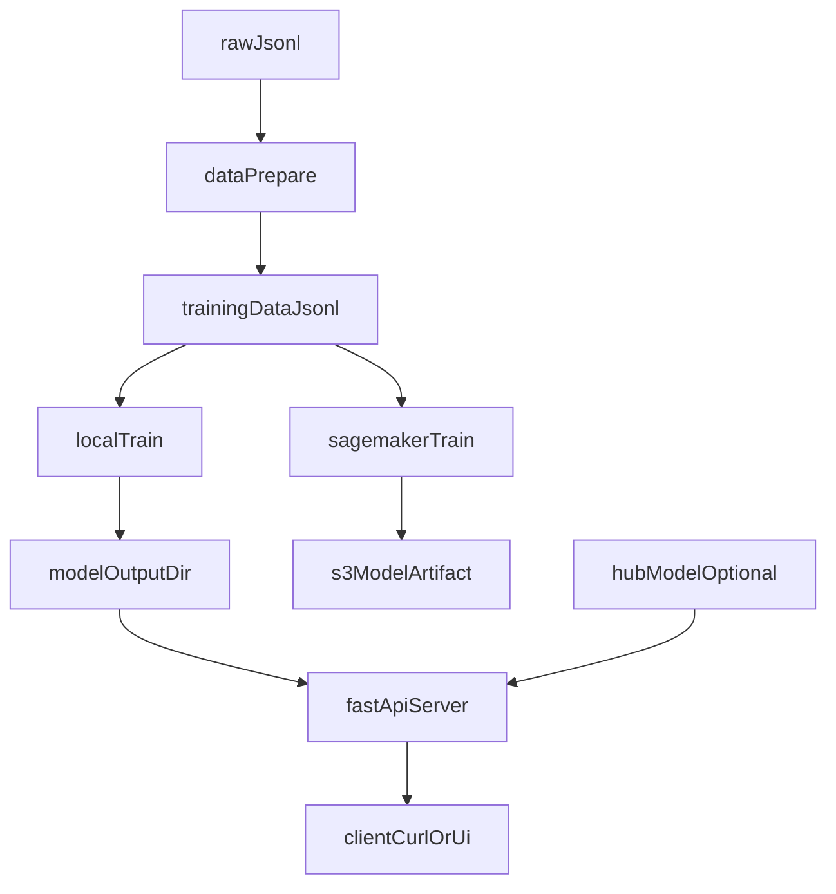

# LLaMA 2 Resume Customizer

A production-grade project demonstrating **LLM fine-tuning and deployment** on AWS, featuring a custom resume generator that tailors resumes to specific job descriptions and required tools.

## 🎯 Project Overview

This project showcases:
- **LLM Fine-tuning**: Train LLaMA 2 on custom resume data
- **AWS Expertise**: Both managed (SageMaker) and self-managed (EC2) approaches
- **Multiple Deployments**: HuggingFace Hub, Ollama, FastAPI REST API
- **Production-Ready**: logging, error handling, validation
- **Scalability**: Ready for real-world use

### Key Features
✅ Fine-tune LLaMA 2 on resume/job description pairs  
✅ Generate customized resumes based on job requirements  
✅ Deploy on AWS with two different approaches  
✅ REST API for integration  
✅ Local deployment with Ollama  
✅ Model hosting on HuggingFace Hub  
✅ Complete documentation and examples  

---

## 📁 Project Structure

```
resume app_lm_aws/
├── README.md                 # Project overview + workflows (this file)
├── QUICKSTART.md             # Short runbook
├── AWS_SETUP.md              # AWS notes + commands
├── requirements.txt          # Python dependencies
├── .env.example              # Environment variables template
├── .gitignore
│
├── sample_training_data.jsonl # Sample raw resume/job pairs (JSONL)
├── data_prepare.py           # Raw JSONL → training JSONL
├── train_local.py            # Local/EC2 fine-tuning (LoRA by default)
├── sagemaker_train.py        # Managed SageMaker training job
│
├── inference_api.py          # FastAPI inference server (REST)
├── example_inference.py      # Direct python inference example
├── test_api.py               # Simple API test client
│
├── setup.sh
├── train.sh
└── run_api.sh
```

---

## 🧭 Workflow (data → train → serve)

### Architecture / data-flow



### Serving source (important)
The API loads the model from `MODEL_NAME` (see `.env.example` and `config.py`). You typically choose one:
- **Serve the fine-tuned local model** (recommended after training): set `MODEL_NAME=./model_output`.
- **Serve a HuggingFace model** (quick demo / no local fine-tune): set `MODEL_NAME=meta-llama/Llama-2-7b-hf` (or your HF repo like `your-username/your-model`).

---

## 💻 Local / EC2 workflow (recommended)

### 0) Configure environment
1. Install deps:

```bash
pip install -r requirements.txt
```

2. Create your env file:

```bash
cp .env.example .env
```

3. If you are going to fine-tune locally/EC2 and then serve that model, set:

```env
MODEL_NAME=./model_output
```

### 1) Prepare training data
- **Input**: `sample_training_data.jsonl` (or your JSONL)
- **Command**:

```bash
python data_prepare.py
```

- **Output**: `data/processed/training_data.jsonl`

### 2) Fine-tune (LoRA by default)

```bash
python train_local.py --train-data data/processed/training_data.jsonl --output-dir ./model_output
```

- **Output**: `model_output/` (HuggingFace `save_pretrained()` artifacts)

### 3) Serve via FastAPI

```bash
bash run_api.sh
```

### 4) Smoke test

```bash
curl http://localhost:8000/health
```

```bash
curl -X POST http://localhost:8000/generate \
  -H "Content-Type: application/json" \
  -d '{
    "job_description": "Senior Python Engineer",
    "current_resume": "Base resume: 5 years backend experience building APIs and services...",
    "required_skills": ["Python", "FastAPI", "AWS"]
  }'
```

---

## 🚀 Quick Start (short version)

### Prerequisites
- Python 3.10+
- 8GB+ GPU memory (for local fine-tuning)
- AWS Account (for SageMaker/EC2 deployment)
- HuggingFace account (optional, for model hosting)

### 1) Setup

```bash
pip install -r requirements.txt
cp .env.example .env
```

### 2) Prepare training data

```bash
python data_prepare.py
```

### 3) Fine-tune locally (or on EC2)

```bash
python train_local.py --train-data data/processed/training_data.jsonl --output-dir ./model_output
```

### 4) Serve via FastAPI

```bash
bash run_api.sh
# Visit http://localhost:8000/docs
```

### 5) Generate a resume (API)

```bash
curl -X POST http://localhost:8000/generate \
  -H "Content-Type: application/json" \
  -d '{
    "job_description": "Senior Python Engineer",
    "current_resume": "Base resume: 5 years backend experience building APIs and services...",
    "required_skills": ["Python", "FastAPI", "AWS"]
  }'
```

---

## 🏗️ AWS Deployment Options

### Option 1: SageMaker (Managed)
**Pros**: Fully managed, automatic scaling, monitoring  
**Cons**: Higher cost

```bash
python data_prepare.py
python sagemaker_train.py
```

See `AWS_SETUP.md` for details.

### Option 2: EC2 (Self-Managed)
**Pros**: Cost-effective, full control  
**Cons**: Manual management

```bash
python data_prepare.py
python train_local.py --train-data data/processed/training_data.jsonl --output-dir ./model_output
bash run_api.sh
```

See `AWS_SETUP.md` for details.

---

## ☁️ SageMaker workflow (managed training)

### 0) Prereqs
- AWS credentials configured (e.g. `aws configure`)
- An S3 bucket exists for training data + outputs
- `.env` has at least:

```env
AWS_REGION=us-east-1
SAGEMAKER_ROLE_ARN=arn:aws:iam::YOUR_ACCOUNT_ID:role/SageMakerLLaMA2Role
SAGEMAKER_BUCKET_NAME=your-bucket-name-llama2-resume
```

### 1) Prepare training data

```bash
python data_prepare.py
```

### 2) Start the training job

```bash
python sagemaker_train.py
```

### What `sagemaker_train.py` does
- Uploads `data/processed/` to `s3://$SAGEMAKER_BUCKET_NAME/training-data/...`
- Starts a SageMaker training job using a PyTorch GPU training image
- Writes the job’s model artifact to `s3://$SAGEMAKER_BUCKET_NAME/output/...`

### Where to look for outputs
- **Job status + logs**: SageMaker Console → Training jobs → your job name
- **Artifacts**: S3 bucket from `SAGEMAKER_BUCKET_NAME` (prefixes `training-data/`, `output/`, `code/`)

---

## 📦 Deployment Options

### Option 1: HuggingFace Hub (Easiest)
Host your fine-tuned model publicly or privately on HuggingFace.

```bash
# (recommended) upload the fine-tuned model directory `model_output/` to a HF repo
# then set MODEL_NAME=your-username/your-model in .env for the API to serve it
```

### Option 2: Ollama (Local Deployment)
Perfect for testing and local use.

```bash
python src/deployment/ollama_setup.py
# Then query via Ollama
ollama pull your-model-name
ollama run your-model-name
```

### Option 3: FastAPI (REST API)
Production-ready REST API.

```bash
bash run_api.sh
```

**Example Usage:**
```bash
curl -X POST http://localhost:8000/generate \
  -H "Content-Type: application/json" \
  -d '{
    "job_description": "Senior Python Engineer",
    "current_resume": "Base resume: backend engineer with experience in Python web APIs...",
    "required_skills": ["Python", "FastAPI"]
  }'
```

---

## 📊 Training Data Format

Training data should be JSONL format (one JSON per line):

```json
{
  "job_description": "Seeking Python Developer with AWS expertise",
  "required_skills": ["Python", "AWS", "FastAPI"],
  "current_resume": "John Doe. 5 years Python development...",
  "customized_resume": "John Doe. 5 years Python development with AWS expertise..."
}
```

See `data/raw/sample_training_data.jsonl` for examples.

---

## 🔧 Configuration

Copy `.env.example` to `.env` and update:

```env
# AWS
AWS_REGION=us-east-1
AWS_ROLE_ARN=arn:aws:iam::123456789:role/sagemaker-role

# HuggingFace
HF_TOKEN=your_huggingface_token

# Model
MODEL_NAME=meta-llama/Llama-2-7b-hf
BATCH_SIZE=4
EPOCHS=3
LEARNING_RATE=2e-5
```

---

## 📈 Model Performance

### Metrics Tracked
- Training loss
- Validation loss
- F1 score
- BLEU score (for text generation quality)
- Inference latency

### Sample Results
```
Epoch 1: Loss=2.45, Val_Loss=2.38
Epoch 2: Loss=1.89, Val_Loss=1.92
Epoch 3: Loss=1.45, Val_Loss=1.51

Inference Speed: ~2.3 tokens/sec (single GPU)
```

---

## 🧪 Testing

```bash
# Run all tests
pytest tests/

# Run specific test
pytest tests/test_inference.py

# With coverage
pytest --cov=src tests/
```

---

## 🎓 Learning Resources

- [Fine-tuning Guide](./docs/FINETUNING.md)
- [AWS Setup Guide](./aws/README_AWS.md)
- [API Documentation](./docs/API.md)
- [Deployment Guide](./docs/DEPLOYMENT.md)

---

## 📝 Example Notebooks

1. **01_data_exploration.ipynb** - Understand your data
2. **02_local_testing.ipynb** - Test fine-tuning locally before AWS
3. **03_inference_examples.ipynb** - See inference in action

---

## 🔐 Security & Best Practices

✅ Use `.env` for secrets (never commit!)  
✅ IAM roles for AWS access  
✅ Model versioning with git-lfs  
✅ Input validation on API endpoints  
✅ Rate limiting on production API  
✅ Monitoring and logging  

---

## 🚀 Next Steps

1. **Prepare Your Data**: Replace sample data with real training data
2. **Test Locally**: Run fine-tuning on your machine first
3. **Deploy to AWS**: Choose SageMaker or EC2 based on needs
4. **Monitor**: Track model performance in production
5. **Iterate**: Collect feedback and retrain

---

## 📚 Project Highlights for Interviews

🎯 **Technical Skills Demonstrated**:
- Large Language Models (LLaMA 2)
- Fine-tuning & Transfer Learning
- AWS cloud services (SageMaker, EC2)
- Python, FastAPI
- MLOps & Model Deployment
- REST APIs & Web Services

🎯 **Business Value**:
- Automated resume customization
- Reduced manual work
- Scalable solution
- Cost-effective deployment options

---

## 💼 Production Checklist

- [ ] Data quality validation
- [ ] Model evaluation metrics established
- [ ] Error handling & logging implemented
- [ ] API rate limiting configured
- [ ] API starts and health check passes
- [ ] AWS IAM policies secured
- [ ] Monitoring & alerts set up
- [ ] Documentation complete
- [ ] Unit tests passing
- [ ] Load testing completed

---

## 🤝 Contributing

Contributions welcome! Please:
1. Fork the repo
2. Create a feature branch
3. Add tests for new features
4. Submit a pull request

---

## 📄 License

MIT License - See LICENSE file for details

---

## 📧 Contact

Questions? Open an issue or reach out!

---

**Built with ❤️ to showcase practical LLM engineering**
